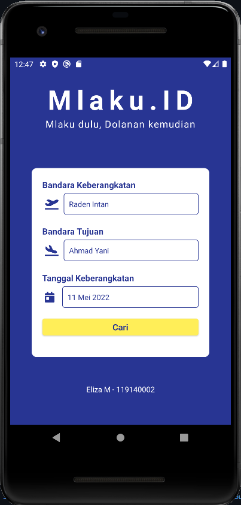
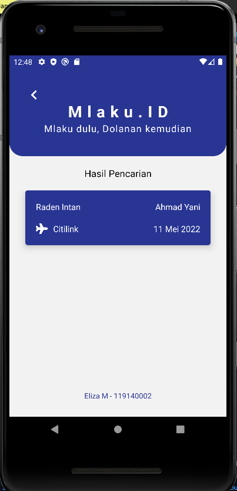

# TUGASPAMMINGGU3 
## Mlaku.ID (Mlaku Dulu, Dolanan Kemudian)
Aplikasi Sederhana menggunakan React Native
Eliza Maharani - 119140002

### 1 : Membuat Aplikasi dengan perintah
`npx react-native init nama_project`

### 2 : Setelah aplikasi terbuat, buka program aplikasi di vs code dengan perintah
`code .`

### 3 : Buka emulator
bisa menggunakan perintah `yarn android` namun sebelumnya harus menginstall yarn dulu menggunakan `npm install -g yarn` atau menggunakan perintah `npx react-native run-android`

### 4: Membuat Aplikasi 
#### install react-navigation
untuk membuat dua tampilan screen dibutuhkan import tambahan yaitu react-navigation yang dapat di install menggunakan perintah `yarn add @react-navigation/native` lalu install dependenciesnya dengan perintah `yarn add react-native-screens react-native-safe-area-context` bisa juga menggunakan npm.

#### install react-native-vector-icons
untuk memberikan icon pada tampilan membutuhkan import tambahan yaitu react-native-vector-icons dengan menggunakan perintah `yarn add  react-native-vector-icons` lalu importkan pada file.js yang akan menggunakan icon tersebut

#### membagi lembar kerja
membuat 3 lembar kerja file.js dimana `App.js` digunakan untuk navigation screen nya lalu `Home.js` digunakan untuk tampilan halaman pertama dan `Details.js` digunakan untuk tampilan kedua. Lalu kita dapat memulai membuat program seperti yang dicontohkan.

### 5: Passing data antar screen
Passing data dapat dilakukan dengan menggunakan perintah `onPress` yang diberikan navigation ke screen lain dan data yang ingin dikirimkannya.

### 6: Menampilkan data
Menampilkan data dapat memgunakan `FlatList` agar dapat ditampilkan secara terurut

## Tampilan program Mlaku.Id 

Masih banyak kekurangan dari program ini yang harus dikembangkan terimakasih :) 
